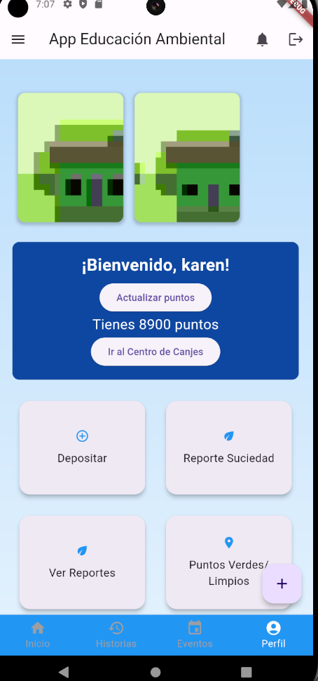
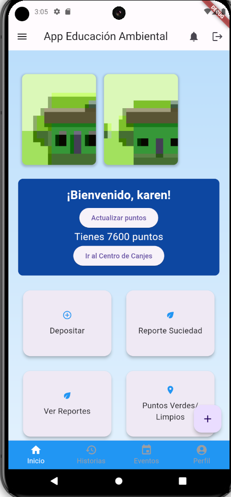

# Aplicación Móvil APPECOEMA

Aplicación desarrollada en Flutter junto al Equipo AppEcoEMA, ganador de proyecto por haber participado en una incubadora.

## Integrantes

- **Desarrollador**: Víctor Godoy Roa
- **Líder del Proyecto**: Karen Pacheco Milla
- **Directora de Operaciones**: Grisselle Gatica

## Capturas de la Aplicación

Aquí puedes poner algunas capturas de pantalla de tu aplicación para que los visitantes tengan una idea de cómo se ve.

## Licencia

Información sobre la licencia del proyecto.
